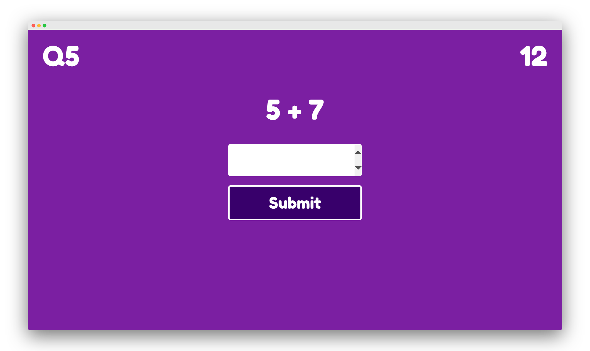
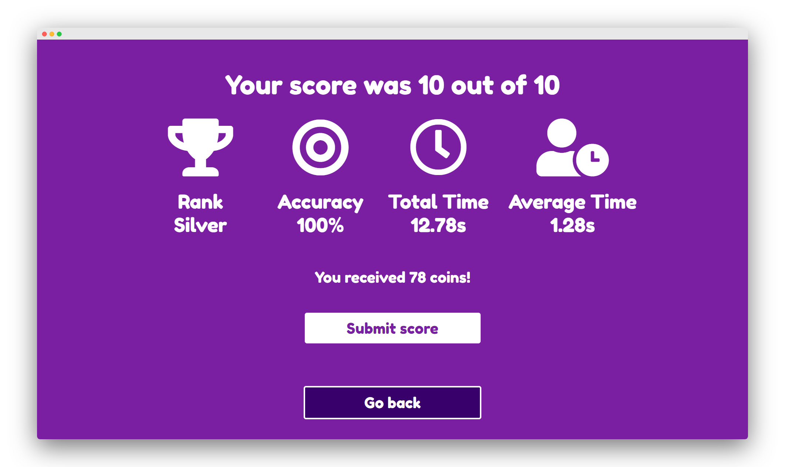

# Mathü 
Learn the basics of math with the help of powerful AI.

[](https://mathu.ca) [](https://mathu.ca)

## Concept
Our vision is for Mathü to be an analytical engine that is capable of understanding student needs and adapting to individual situations. Teacher panels, AI, and head-to-head gameplay will all be added in the near future!

## Algorithms
##### Coin Algorithm
```([score/time] * 10 ) rounded```

The algorithm rewards higher scores in lower times. The coins are multiplied by 10 to create a maximum *human achievable* limit of 100 coins. In theory, going beyond a 100 coins is possible but close to impossible. However, Mathü does not *limit* the number of coins that can be awarded.

##### Score Algorithm
```(correct questions/total questions) * 100```

The score is a 0-100 number that determines the accuracy of a user. This is simply a percentage, and is self-explanatory.

##### Ranking Systems

| Gold | Silver | Bronze |
| ---- | ------ | ------ |
|(score/time)>10|(score/time)>7|Anything else|

## The Team
The team behind Mathü consists of high school students and a high school teacher from the GTA.

Name | Email
-----|-----
Chris|chris_ujimoto@hotmail.com
Param|contact@param.me
Youcef|youcefs2121@gmail.com
Kaarthick|worldpeace6775@gmail.com
Shangheethan|shangheethan@gmail.com

###### This project was the winning entry in the Imagine Hackathon pitch competition at Brampton
